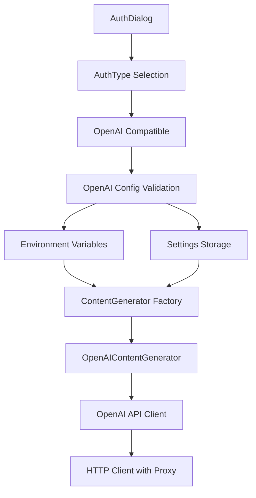

# 设计文档

## 概述

为Wugou CLI添加OpenAI兼容认证类型支持，通过扩展现有的认证系统来支持任意OpenAI兼容的API服务。该功能将集成到现有的认证框架中，提供与Gemini API类似的用户体验。

## 指导文档一致性

### 技术标准 (tech.md)
- 遵循现有的TypeScript类型安全模式
- 使用现有的配置管理系统进行参数存储
- 复用现有的HTTP客户端基础设施
- 保持与现有认证类型一致的接口设计

### 项目结构 (structure.md)
- 在`packages/core/src/core/`中添加OpenAI内容生成器实现
- 在`packages/cli/src/config/`中添加OpenAI配置验证
- 在`packages/cli/src/ui/auth/`中更新认证对话框
- 保持与现有认证类型相同的模块结构

## 代码重用分析

### 要利用的现有组件
- **ContentGenerator接口**：复用现有的内容生成器抽象，实现OpenAI兼容的生成器
- **配置管理系统**：使用现有的settings.ts和schema.ts进行参数存储和验证
- **HTTP客户端基础设施**：复用现有的HTTP选项和代理配置
- **认证对话框**：扩展现有的AuthDialog组件添加新选项
- **验证框架**：使用现有的validateAuthMethod模式进行参数验证

### 集成点
- **AuthType枚举**：在core/contentGenerator.ts中添加新的枚举值
- **内容生成器工厂**：在createContentGenerator函数中添加OpenAI分支
- **认证验证**：在cli/config/auth.ts中添加OpenAI配置验证
- **设置模式**：在cli/config/settingsSchema.ts中添加OpenAI相关设置
- **认证对话框**：在cli/ui/auth/AuthDialog.tsx中添加新选项

## 架构

采用插件式架构，将OpenAI兼容服务作为新的认证类型集成到现有系统中。保持与现有认证类型相同的接口契约，确保无缝切换。



## 组件和接口

### OpenAIContentGenerator
- **目的：** 实现OpenAI兼容的API内容生成
- **接口：** 实现ContentGenerator接口的所有方法
- **依赖：** GoogleGenAI客户端配置为OpenAI兼容模式
- **重用：** 基于现有的LoggingContentGenerator模式

### OpenAIConfigValidator
- **目的：** 验证OpenAI认证配置参数
- **接口：** validateOpenAIConfig(baseUrl, apiKey, modelName)
- **依赖：** URL验证库，环境变量访问
- **重用：** 基于现有的validateAuthMethod模式

### OpenAISettings
- **目的：** 管理OpenAI相关的配置设置
- **接口：** 通过settingsSchema访问和存储
- **依赖：** 现有的settings管理系统
- **重用：** 复用现有的设置模式和存储机制

## 数据模型

### OpenAI配置模型
```typescript
interface OpenAIConfig {
  baseUrl: string;        // OpenAI兼容服务的base URL
  apiKey: string;         // API密钥
  modelName: string;      // 模型名称，如gpt-3.5-turbo
  httpOptions?: {         // HTTP选项
    headers?: Record<string, string>;
    proxy?: string;
  };
}
```

### 环境变量映射
```
OPENAI_BASE_URL     -> baseUrl
OPENAI_API_KEY      -> apiKey  
OPENAI_MODEL_NAME   -> modelName
```

## 错误处理

### 错误场景
1. **无效Base URL：**
   - **处理：** 验证URL格式，检查是否可访问
   - **用户影响：** 显示"Invalid OpenAI base URL format"错误消息

2. **缺失API密钥：**
   - **处理：** 检查环境变量和设置中的API密钥
   - **用户影响：** 显示"OpenAI API key is required"错误消息

3. **API调用失败：**
   - **处理：** 捕获HTTP错误，解析OpenAI错误响应
   - **用户影响：** 显示具体的API错误信息，如认证失败、速率限制等

4. **不支持的模型：**
   - **处理：** 验证模型名称格式，提供常见模型建议
   - **用户影响：** 显示"Unsupported model name"并建议可用模型

## 测试策略

### 单元测试
- OpenAIContentGenerator的方法实现测试
- OpenAI配置验证逻辑测试
- 环境变量解析测试
- 错误处理和边界条件测试

### 集成测试
- 与现有认证系统的集成测试
- 配置管理系统集成测试
- HTTP客户端和代理配置测试
- 认证对话框UI集成测试

### 端到端测试
- 完整的OpenAI认证流程测试
- 内容生成和流式响应测试
- 错误场景的用户体验测试
- 与现有认证类型的切换测试